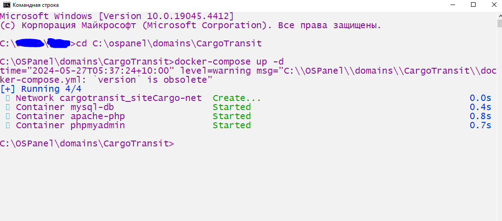
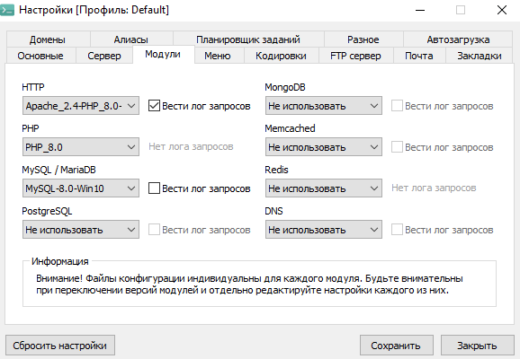
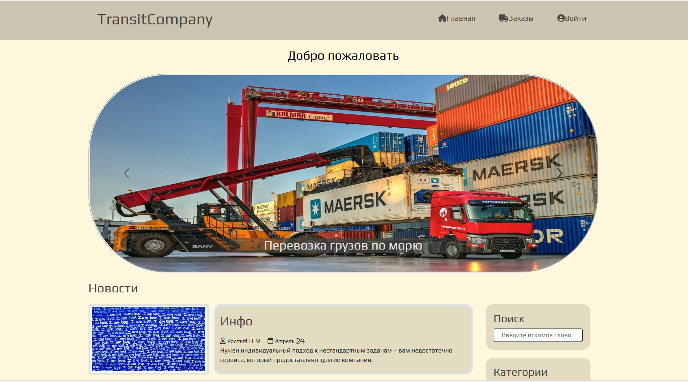

# Сайт грузоперевозок

***

## Содержание

Сайт разработан с использованием ряда технологий

| PHP |   JS   |    Верстка     |  SQL  |   Запуск   |
|:---:|:------:|:--------------:|:-----:|:----------:|
| PDO |  ajax  | html,  css | MySql |   docker   |
|     | jQuery |   bootstrap    |       | openserver |

Фреймоврки не использовались.
___
> ### Функционал
>> * Коннект к бд. [Connect.php](src%2FApp%2FDatabase%2FConnect.php).
>>
>> * Авторизация/регистрация. [DataProcessing.php](src%2FApp%2FDatabase%2FDataProcessing.php)
>>
>> * Серверная/клиентская валидация.
>>
>> * Ветввление зависящие от роли пользователя. [Header.php](src%2FApp%2FInclude%2FHeader.php)
>>
>> * Личный кабинет пользователя.
>>
>> * Админка.
>>
>> * Запросы к бд через интерфейс PDO. [Database.php](src%2FApp%2FDatabase%2FDatabase.php)
>>
>> * Возможность оформлять заказы на грузоперевозку.
>>
>> * Возможность админа подтверждать/отменять заказы пользователей.
>>
>> * Вывод данных из бд по GET/POST методам через ajax.
>>> [ManagerProcessing.js](src%2Fassets%2Fjs%2FManagerProcessing.js)
>>>
>>> [OrderProcessing.js](src%2Fassets%2Fjs%2FOrderProcessing.js)
>>>
>>> [UserProcessing.js](src%2Fassets%2Fjs%2FUserProcessing.js)

___

## Запуск проекта

### Запуск локального сервера

#### Через docker

* Запустить docker.

* Зайти в терминал.

* ___Ввести комнаду:___
        

    cd Диск:\путь\к\вашему\проекту
___Далее ввести команду:___

    docker-compose up -d

Пример :

#### Через openserver

Поместить проект в папку domains

Сделать следующие настройки:

Запустить запустить сервер. Зайти в мои проекты и запустить домен проекта.
___
## Добавление базы данных

### docker

Перейти по адресу:

        localhost:1453

Ввести логин : __root__

Ввести пароль : __root__

* Выбрать пустую базу данных __cargo_transit_db__
* Нажать на кнопку "Импорт" и выбрать файл [cargo_transit_db.sql](cargo_transit_db.sql) из корневой папки проекта.

### Openserver

Запустить Openserver. Зайти в phpMyAdmin, в зависимости от версии ввести:

* логин - root, пароль - пустой.
* логин - root, пароль - root.
* логин - root, пароль - mysql.

* __СОЗДАТЬ__ пустую базу данных __cargo_transit_db__
* Нажать на кнопку "Импорт" и выбрать файл [cargo_transit_db.sql](cargo_transit_db.sql) из корневой папки проекта.

## Использование

Интуитивно понятное. Выбираете роль при регистрации, регистрируетесь.
Далее пользуетесь возможностями приложения (Создаете, подтверждаете заказы).

website on CSS, HTML, Bootsrap, PHP, js, jQuery with a local MySql database
